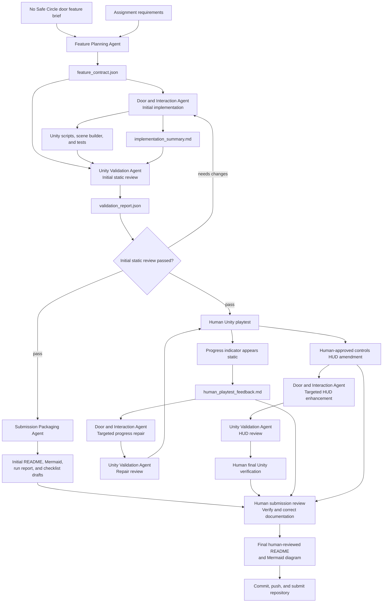

# No Safe Circle - Sealed Door Prototype

**Assignment:** Assignment 3 - Build an Agent Crew  
**Game:** No Safe Circle  
**Unity version:** 6000.1.8f1

## What the Crew Produces

This Claude Code agent crew produces a game-ready Unity prototype of the
sealed-door mechanic from **No Safe Circle**.

The prototype includes:

- WASD player movement
- A sealed door that opens after holding E for five uninterrupted seconds
- Cancellation when the player releases E, moves, or takes damage
- A contextual interaction prompt
- A visible progress indicator
- An always-visible controls HUD
- A debug/test damage control
- An Editor command that builds the prototype scene
- Edit Mode and Play Mode tests
- Structured contracts, validation reports, execution logs, and documentation drafts

The generated Unity feature is located under:

`Assets/NoSafeCircle/DoorPrototype/`

## Why This Feature Belongs to No Safe Circle

The sealed door is one of the central mechanics in the **No Safe Circle** GDD.
The player must create five seconds of temporary safety, remain at the door,
and avoid being interrupted by movement or damage.

This prototype isolates that mechanic so it can be implemented and tested
before enemy pursuit, spells, door durability, and the full dungeon are added.

## Agent Roles

| Agent | Main Input | Output |
|---|---|---|
| **Feature Planning Agent** | Assignment requirements, approved door brief, Unity project information | `AgentCrew/outputs/feature_contract.json` |
| **Door and Interaction Agent** | Approved feature contract and, during later passes, validation or human feedback | Unity C# scripts, Editor scene builder, automated tests, and `AgentCrew/outputs/implementation_summary.md` |
| **Unity Validation Agent** | Feature contract, implementation summary, generated source files, scene-builder code, and tests | `AgentCrew/outputs/validation_report.json` with evidence and a `pass` or `needs_changes` result |
| **Submission Packaging Agent** | Initial pipeline artifacts and assignment requirements | Initial README, Mermaid diagram, run report, and submission checklist drafts |

Each agent ran as a separate Claude Code invocation. The agents coordinated by
reading and writing file artifacts rather than sharing one continuous
conversation.

The complete run log records eight Claude Code invocations:

- Four agents in the initial pipeline
- Two agents in the targeted progress-indicator repair
- Two agents in the targeted controls-HUD pass

### Why Each Agent Is Necessary

- **Feature Planning Agent:** decided exactly what the door prototype needed to do.
- **Door and Interaction Agent:** built the Unity feature and fixed it when problems were found.
- **Unity Validation Agent:** checked the work for mistakes and made sure it matched the plan.
- **Submission Packaging Agent:** created the first drafts of the README, Mermaid diagram, run report, and checklist.

The agents depended on the work from the previous steps. 
The planner defined the feature, the implementation agent built it, the validator reviewed it, 
and the packaging agent organized the results for submission.

## Human Role

The human developer is **not a fifth agent**. The human remains responsible for:

- Running the generated feature in Unity
- Evaluating visual and runtime behavior
- Approving small scope changes
- Returning concrete defects to the agent crew
- Reviewing the repository for factual accuracy
- Correcting and approving the final submission documents

The final README and Mermaid diagram are therefore human-reviewed documents,
not unedited Claude output.

## What We Actually Did

Development was iterative rather than a single perfect generation.

### 1. Initial Four-Agent Pipeline

We ran:

```powershell
.\Run-AgentPipeline.ps1
```

The initial pipeline executed:

1. Feature Planning Agent
2. Door and Interaction Agent
3. Unity Validation Agent
4. Submission Packaging Agent

The Feature Planning Agent converted the approved door brief into
`feature_contract.json`.

The Door and Interaction Agent generated the Unity runtime scripts, Editor
scene builder, assembly definitions, and Play Mode tests.

The Unity Validation Agent performed static source review and returned a
passing report with no blocking issues.

The Submission Packaging Agent created the first README, Mermaid diagram, run
report, and submission checklist. These were initial documentation drafts based
on the artifacts available at that time.

### 2. Human Unity Playtest Found a GUI Defect

The human developer opened the generated scene in Unity.

The gameplay logic worked: holding E for five seconds opened the door. However,
the visible progress bar appeared static instead of visibly filling during the
opening attempt.

This problem was not discovered by the initial static source review. It was
found by running and observing the feature in Unity.

The defect, expected behavior, and required retest steps were recorded in:

`AgentCrew/inputs/human_playtest_feedback.md`

### 3. Targeted Progress-Indicator Repair

We ran:

```powershell
.\Run-TargetedRepair.ps1
```

This targeted workflow executed:

1. Door and Interaction Agent - Human Playtest Repair
2. Unity Validation Agent - Human Repair Review

The Door and Interaction Agent diagnosed the generated scene configuration. The
runtime progress binding was already updating `fillAmount`, but the generated
fill Image had no sprite. Unity therefore rendered it as a static rectangle
instead of visible filled geometry.

The agent repaired the Editor scene builder so the progress display uses a
built-in UI sprite with a horizontal filled Image. It also added Edit Mode tests
that verify:

- The fill Image has a sprite
- The Image is configured as `Filled`
- The fill method is horizontal
- Running the scene builder twice does not duplicate the progress hierarchy

The Unity Validation Agent reviewed the repair and returned a passing static
validation result.

### 4. Human-Approved Controls HUD Amendment

After testing the prototype, the human developer approved a small presentation
enhancement: an always-visible controls HUD.

The approved scope amendment was recorded in:

`AgentCrew/inputs/approved_scope_amendment_controls_hud.md`

The HUD communicates:

- `WASD` - Move
- `Hold E` - Open Door
- Moving or taking damage cancels opening
- `[Debug/Test] K` - Take Damage

The debug key is clearly labeled as a testing control rather than a normal
player ability.

### 5. Targeted Controls-HUD Pass

We ran:

```powershell
.\Run-TargetedUIPass.ps1
```

This targeted workflow executed:

1. Door and Interaction Agent - Controls HUD Enhancement
2. Unity Validation Agent - Controls HUD Review

The Door and Interaction Agent added the HUD through the Editor scene builder,
not through a one-time manual Inspector edit.

The agent also added Edit Mode coverage for:

- HUD existence
- HUD text matching the implemented controls
- Separation from the prompt and progress display
- No duplicate HUD after running the scene builder twice

The latest Unity Validation Agent review returned:

- Static validation status: `pass`
- Blocking issues: `0`

The validator also confirmed that the earlier progress-indicator repair remained
present.

### 6. Human Submission Review

The Submission Packaging Agent created the initial documentation before the
human playtest, targeted repair, and controls-HUD enhancement occurred.

The human developer therefore performed a final editorial and factual review of
the repository and revised the README and Mermaid diagram so they describe the
process that actually happened.

During this review, the human developer:

- Added the human-discovered progress-indicator defect
- Documented `Run-TargetedRepair.ps1`
- Documented the diagnosed cause and generated-scene repair
- Added the controls-HUD scope amendment
- Documented `Run-TargetedUIPass.ps1`
- Corrected the implementation role name to **Door and Interaction Agent**
- Updated the Mermaid diagram to show the iterative workflow
- Fixed text-encoding and formatting problems
- Confirmed that the README names **No Safe Circle**
- Confirmed that the README explains what the crew produced for the game

The final README and Mermaid diagram are human-reviewed submission documents
built from the crew's drafts, generated implementation, validation reports,
run log, and human test evidence.

## Iterative Workflow



The standalone Mermaid source is located at:

`Docs/architecture.mmd`

## Commands

### Initial pipeline

```powershell
.\Run-AgentPipeline.ps1
```

### Targeted progress repair

```powershell
.\Run-TargetedRepair.ps1
```

### Targeted controls-HUD pass

```powershell
.\Run-TargetedUIPass.ps1
```

### Inspect generated artifacts

```powershell
.\Inspect-AgentOutputs.ps1
```

## Main Files

| Purpose | Path |
|---|---|
| Main orchestration code | `AgentCrew/orchestrator.py` |
| Targeted repair orchestration | `AgentCrew/targeted_repair.py` |
| Targeted HUD orchestration | `AgentCrew/targeted_ui_pass.py` |
| Initial pipeline runner | `Run-AgentPipeline.ps1` |
| Targeted repair runner | `Run-TargetedRepair.ps1` |
| Targeted HUD runner | `Run-TargetedUIPass.ps1` |
| Assignment requirements | `AgentCrew/inputs/assignment_requirements.md` |
| Approved feature brief | `AgentCrew/inputs/door_feature_brief.md` |
| Feature contract | `AgentCrew/outputs/feature_contract.json` |
| Human playtest feedback | `AgentCrew/inputs/human_playtest_feedback.md` |
| Controls HUD amendment | `AgentCrew/inputs/approved_scope_amendment_controls_hud.md` |
| Implementation summary | `AgentCrew/outputs/implementation_summary.md` |
| Latest validation report | `AgentCrew/outputs/validation_report.json` |
| Complete execution log | `AgentCrew/outputs/crew_run_log.json` |
| Initial run report | `AgentCrew/outputs/run_report.md` |
| Submission checklist | `AgentCrew/outputs/submission_checklist.md` |
| Mermaid source | `Docs/architecture.mmd` |
| Generated Unity feature | `Assets/NoSafeCircle/DoorPrototype/` |

## Build and Verify in Unity

1. Open the project in Unity 6000.1.8f1.
2. Allow all scripts to compile and confirm there are no red Console errors.
3. Run:

   `No Safe Circle > Build Door Prototype Scene`

4. Run the command a second time and confirm the generated hierarchy and UI are
   not duplicated.
5. Open **Window > General > Test Runner**.
6. Select the **EditMode** tab and click **Run All**.
7. Select the **PlayMode** tab and click **Run All**.
8. Confirm that the generated door-prototype tests finish with green
   checkmarks and no failures.

## Assignment Deliverables

- **Crew code:** `AgentCrew/`
- **Mermaid diagram:** `Docs/architecture.mmd` and the embedded diagram above
- **README:** this human-reviewed file
- **Game connection:** the crew produces the sealed-door prototype for
  **No Safe Circle**

## AI Usage

Claude Code was used only during development to plan, generate, statically
review, refine, and draft documentation for the prototype.

No generative AI runs inside the finished Unity game. The final Unity testing,
submission review, and approval remain human responsibilities.
